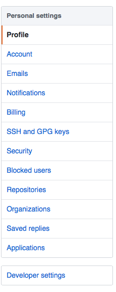
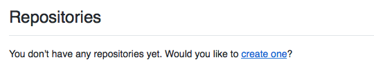

# GitHub Tutorial

_by Wei Zheng_

---
## Git vs. GitHub
* Git is the system that used for version control, in other word, git helps you keep trackyour code
* GitHub is the platform that you can to share your work with others, and you can also visually see your code without using the command line

#### _GitHub need Git, but git does not required GitHub!_

---
## Initial Setup
### _How do you create a GitHub Account?_
* [Go to Github Sign Up Page](https://github.com/join?source=header) and you will see something like 
* After you filled in your information, clcik the  "Create an account"
* You will now choose your plan, choose "Unlimited public repositories for free"   
* Lastly, you will Tailor you experience but checking the box that applied to you   
#### After Setup your account, you will need create a SSH key  
### _So, How do you create a SSH key?_
* First, as you login your GitHub account, you will see something like this 
* Then, you will go to the top right and click your icon, and you will see  and click the "setting"
* After you clicked setting, you the right you will see something like this , go head and clicked on "SSH and GPG keys"
* As you do so, you will see SSH Keys and GPG Keys sections, on the right of SSH Keys section, clicked "New SSH key" 

---
## Repository Setup
You will see something like this 

---
## Workflow & Commands
#### After setting up your repository, and having some basic understand of how git works, you will learning how to "push" your work to GitHub

### git status
_**Q: What is git status?**_  
**A: git status is the git command that helps you know the status of your files, there are three different status of file that you can find through git status**
1. Untracked: The file is in your directory, but it is not in the staging area (not ready to be commited)
2. Modified: The file is i
3. Tracked/Staged:

### git add  
_**Q: What is git add?**_  
**A: By using git add, you add the file you want into the staging area, where works are tracked and ready to be commit**  

| Working Directory | Staging Area | Repository |
| :-------------: |:-------------:|:-----:|
| Where the file stored before git add. You can makde changes to the file in working directory| Where the file stored after git add, it is a temporary space that file rest, so they can be commit anytime  | Where all the changes are being stored and saved it as commit |
### git commit  
_**Q: What is git commit?**_  
**A: After add you add file to the staging area, the works are tracked but it is not being commit(not being saved). Therefore, git commit saves your work and remember the changes as commits!**
### git push
_**Q: What is git push?**_  
**A:**

---
## Rolling Back Changes
There are many times that you made mistake and accidentally add, commit or even push the file. There is not redo botton in git, but you can there are some ways that you can "fix" your mistakes

---
## Error Handling

---
## Collaboration