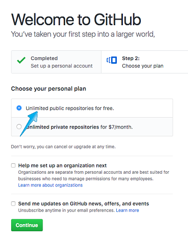

# GitHub Tutorial

_by Wei Zheng_

---
## Git vs. GitHub
* Git is the system that used for version control, in other word, git helps you keep trackyour code
* GitHub is the platform that you can to share your work with others, and you can also visually see your folders/files without using the command line

#### _GitHub need Git, but git does not required GitHub!_


---
## Initial Setup
### _How do you create a GitHub Account?_
1. [Go to Github Sign Up Page](https://github.com/join?source=header) and you will see something like 
2. After you filled in your information, clcik the  "Create an account"
3. You will now choose your plan, choose "Unlimited public repositories for free"   
4. Lastly, you will Tailor you experience but checking the box that applied to you 
5. Go to you email and verify your email
**And NOW, you have your own GitHub account!**

#### After Setup your account, you will need create a SSH key, the key that use to authenticate the user (make sure your are the owner of the account)
### _So, How do you create a SSH key?_  
#### Heads-Up! All the following directions only apply if you had setted up you [clound9 account](https://c9.io/)
1. First, as you login your GitHub account, you will see something like this 
2. Then, you will go to the top right and click your icon, and you will see  and click the "**setting**"
3. After you clicked setting, you the right you will see something like this , go head and clicked on "**SSH and GPG keys**"
4. As you do so, you will see SSH Keys and GPG Keys sections, on the right of SSH Keys section, clicked "New SSH key" 
5. Go to your c9 page, and on the top right, go head and click on the setting(gear icon) 
6. On the left, click **SSH Keys**, and copy all the things in the grey box, like the pic shown 
7. Go back to GitHub, put title as "**clound9**" and paste everything to the **Key** box and click **Add SSH Key**

**Here you go, your GitHub is connected to your c9!**


---
## Repository Setup
### _How do you create a repository?_
1. On the top right, you will see something like this in your GitHub home page , go head click the "**+**"
2. After you do so, you will see the following, , click "**New repository"** to create your new repo!
3. Under the **Repository name**, fill in the name of your repository. As the image below, I named my repository as **new-repository** 
4. After filled out the name, click on the green button. 
5. You will see something like that , make sure you select "SSH" instead of "HTML", so you don't need to type your username and password everything you use it
6. Then follow the directions:
    * go back to your c9, create a folder and named it the exactly the same thing as your repo name (hint: use `mkdir foldername`)
    * move into your new folder (`cd foldername`), and create a README.md file (`touch README.md`)
    * type `git init` in your new folder, **never use `git init` in your workspace**
    * type `git add README.md` in your terminal
    * type `git commit -m "first commit"`
    * go back to your github and copy `git remote add origin git@github.com:usernmae/xxxx.git`
    * Finally, type in `git push -u origin master`  

### BOOM! You have a repository on the GitHub now!


---
## Workflow & Commands
#### After setting up your repository, and having some basic understand of how git works, you will learning how to "push" your work to GitHub. As shown in the table below, Git project divied to three different part: working directory, staging area and repository. 

| Working Directory | Staging Area | Repository |
| :-------------: |:-------------:|:-----:|
| Where the file stored before git add. You can makde changes to the file in working directory| Where the file stored after git add, it is a temporary space that file rest, so they can be commit anytime  | Where all the changes are being stored and saved it as commit |

### git status
_**Q: What is git status?**_  
**A: git status is the git command that helps you know the status of your files, there are three different status of file that you can find through git status**  
**- How to type: git(space)status**
1. Untracked: The file is in your directory, but it is not in the staging area (not ready to be commited)
2. Modified: The file was previously added, but there is change of the file (being renamed or deleted)
3. Tracked/Staged: The file is in the staging area and ready to be commit!!

### git add  
_**Q: What is git add?**_  
**A: By using git add, you add the file you want into the staging area, where works are tracked and ready to be commit**  
#### You can git add many ways
1. `git add filename`: you add specific file to the staging area  
**- How to type: git(space)add(space)filename**

_In the example below, I created for files, but I only add **sep-11** to the staging file_

```bash
username:~/workspace/sep (master) $ touch sep-9 sep-10 sep-11 sep-12
username:~/workspace/sep (master) $ git add sep-11
username:~/workspace/sep (master) $ git status
On branch master

No commits yet

Changes to be committed:
  (use "git rm --cached <file>..." to unstage)

        new file:   sep-11
```

2. `git add .` : you add all the exist file to the staging area  
**- How to type: git(space)add(space).**  

_In the example below, I add all the files I just created to the staging area_

```bash
username:~/workspace/sep (master) $ git add .
username:~/workspace/sep (master) $ git status
On branch master

No commits yet

Changes to be committed:
  (use "git rm --cached <file>..." to unstage)

        new file:   sep-9
        new file:   sep-10
        new file:   sep-11
        new file:   sep-12
```

3. `git add --all` : you add all the file, including the deleted/renmaed file to the staging area   
**- How to type: git(space)add(space)--all**

_In the example below, I renamed the **sep-9** to **sep-09**, so if I do `git add .`, **sep-09** is not going to be add to staging area. Therefore, I used `git add --all` to add all the files_

```bash
username:~/workspace/sep (master) $ mv sep-9 sep-09
username:~/workspace/sep (master) $ git status
On branch master

No commits yet

Changes to be committed:
  (use "git rm --cached <file>..." to unstage)

        new file:   sep-10
        new file:   sep-11
        new file:   sep-12

Untracked files:
  (use "git add <file>..." to include in what will be committed)

        sep-09

username:~/workspace/sep (master) $ git add --all
username:~/workspace/sep (master) $ git status
On branch master

No commits yet

Changes to be committed:
  (use "git rm --cached <file>..." to unstage)

        new file:   sep-09
        new file:   sep-10
        new file:   sep-11
        new file:   sep-12
```

### git commit  
_**Q: What is git commit?**_  
**A: After add you add file to the staging area, the works are tracked but it is not being commit (not being saved). Therefore, git commit saves your work and remember the changes as commits!**  
**- How to type: git(space)commit(space)-m(space)"message"**

The format you git commit will be `git commit -m "message/changes in the file"`. The message should be in present tense, and it is extremely important that your message include what you changed in the file, so you or your collaborator can go back to work you have done.

_In the example below, I commmited my changes, and leave a message of what I did_

```bash
username:~/workspace/sep (master) $ git commit -m "create sep-year files"
[master (root-commit) 7a6acd5] create sep-year files
 4 files changed, 0 insertions(+), 0 deletions(-)
 create mode 100644 sep-09
 create mode 100644 sep-10
 create mode 100644 sep-11
 create mode 100644 sep-12
```

### git push
_**Q: What is git push?**_  
**A: Once you create a remote in GitHub and make connection with your local machine, you are now able to send your work to the GitHub where you can saved your work**  
**- How to type: git(space)push**

_In the example, below, I push my latest commit to the GitHub remote_

```bash
username:~/workspace/sep (master) $ git push
Warning: Permanently added 'github.com,192.30.253.112' (RSA) to the list of known hosts.
Counting objects: 3, done.
Delta compression using up to 8 threads.
Compressing objects: 100% (2/2), done.
Writing objects: 100% (3/3), 285 bytes | 285.00 KiB/s, done.
Total 3 (delta 0), reused 0 (delta 0)
To github.com:weiz9762/sep.git
   7a6acd5..4920eae  master -> master
```

However, every time you push your work to the GitHub, you need clarify the name of remote and the branch you want to push to. Therefore, to make your life easier, command `git push -u orgin master` helps you default you push to the orgin master, so you can just easily push your work through `git push`

---
## Rolling Back Changes
There are many times that you made mistake and accidentally add, commit or even push the file. There is not redo botton in git, but you can there are some ways that you can "fix" your mistakes

---
`git checkout -- filename`: Undo the change in file  
**- How to type: git(space)checkout(space)--(space)filename**

```bash
weiz9762:~/workspace/sep (master) $ git checkout -- sep-09
```

| File before git checkout | File after git checkout |
|:------------------------:|:-----------------------:|
|This is all the new changes in the file| |

---
`git reset HEAD filename`: Unstage the file from staging area 
**- How to type: git(space)reset(space)HEAD(space)filename**  

```bash
weiz9762:~/workspace/sep (master) $ git reset HEAD sep-11
Unstaged changes after reset:
M       sep-11
```

| Staging area before |Staging area after |
|:------------------------:|:-----------------------:|
|sep-11 (tracked)|_no file is being tracked_ |

---
`git reset --soft HEAD~1`: Undo the commit  
**- How to type: git(space)reset(space)--soft(space)HEAD~1**

git log before `git reset --soft HEAD~1`

```
commit 4280e5e3b91be31c1524333b0538fbbe88xxxxxxx (HEAD -> master, origin/master)
Author: Username <user@mail.com>
Date:   Sun Oct 15 17:59:31 2017 +0000

    change header size to #1
    
 commit 38387d4a6e6fe871e28fb1cca6cdabebe9xxxxxx
Author: Username <user@mail.com>
Date:   Sun Oct 15 17:58:27 2017 +0000

    add readme
```

git log after `git reset --soft HEAD~1`
```
commit 38387d4a6e6fe871e28fb1cca6cdabebe9xxxxxx (HEAD -> master)
Author: Wei Zheng <weiz9762@hstat.org>
Date:   Sun Oct 15 17:58:27 2017 +0000

    add readme
```
---
`git reset HEAD~1`: single command that combine `git reset HEAD` and `git reset --soft HEAD~1` together, **it undo the commit and unstage the file**

`git reset --hard HEAD~1`: command that commbine all `git reset HEAD`, `git reset --sot HEAD~1` and `git checkout`, **it undo the commit, unstaged the added files and undo the changes in the file**

---
All the above commands will helps you "undo" the change that is not being push to the GitHub, and 
`git revert SHA` will Undo commit snapshot in GitHub by replace the new commit (undo the push)  

* SHA is the series number of your commit, which can be found by using `git log`

---
## Error Handling
If you accidentally use `git init` in your folder, and you want to undo it, all you have to do is `rm -rf .git`

It is real easy to find out if _git_ is running in your repository, there are two ways you can know if git is running
1. Use `ls -all`, and it will shows all files (including hidden file), if you see _.git_, it means that git is runnning in your repository 
2. After your folder is you see _(master)_, it means git is running

---
## Collaboration
`git clone`: make a git repository copy from a remote source (copy all the content in other's remote). You can also push its remote source if you have permissions from the owner.

### Below is the step of cloning
1. In order to clone, you need go to the github page that you want to clone, and click on the green button on the right  
2. make sure it is _SHH_ instead of HTTPS, it will be something like **git@github.com:username/repo-name.git**
3. Then, go back to the terminal, type `git clone SHH`, where the SHH is the key you just copied.
Wooh! You just clone the repository by using `git clone`

`git pull`: pill down the files from the remote repository and merges it with local one

**fork**: Similar like git clone, it make a git repository cope from a remote soure, however it also create new remote that automically connect to your local machine. Therefore, if you fork other's repository, you are about to push your own remote.

### Here is the step of forking:
1. One the top right, you will see something like this,  and go ahead click it
2. After you do so, you will jump to something like this , and you will wait for it to complete
3. Then, you will have an exact repository in remote, go head clone it (follow directions in `git clone`)
4. Go back to c9, Now you have a repository copy in your local machine!